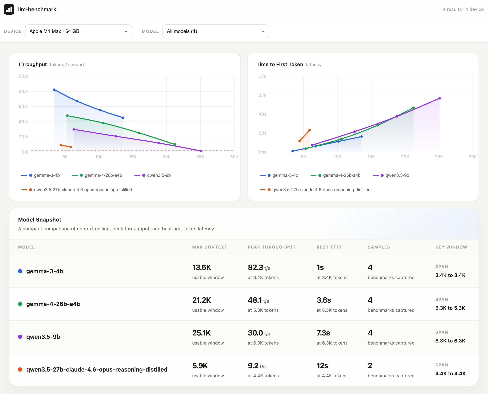

# llm-benchmark



A CLI tool that benchmarks local LLMs running via [LM Studio](https://lmstudio.ai). It discovers available models, lets you choose which to test, then automatically finds each model's maximum usable context window and measures inference speed at multiple context fill levels. Results are persisted and keyed by model + hardware fingerprint so re-runs on different hardware produce separate entries.

## Features

- **Auto-discovers** all models loaded in LM Studio
- **Binary-searches** each model's maximum usable context window (2 048 → 32 768 tokens)
- **Measures inference speed** at 25 / 50 / 75 / 100 % of max context (TTFT + tokens-per-second)
- **Interactive terminal UI** built with [Ink](https://github.com/vadimdemedes/ink) — keyboard-driven model selection, live progress bar, real-time logs
- **Persistent results** saved to `benchmark-settings.json`, keyed by `modelId + hardwareFingerprint` so results survive model updates and multi-machine use
- **Graceful shutdown** — `Ctrl-C` / `SIGTERM` unloads models and stops the LM Studio server cleanly

## Requirements

- [LM Studio](https://lmstudio.ai) installed with the `lms` CLI on your `PATH`
- Node.js 20+
- At least one model downloaded in LM Studio

## Installation

```bash
yarn install
yarn build
```

You can then run it directly:

```bash
yarn start
# or via the bin alias:
yarn llm-benchmark
```

During development you can build + run in one step:

```bash
yarn dev
```

## Usage

1. Start the tool — it spins up the LM Studio server and detects your hardware automatically.
2. Use `↑ / ↓` to move the cursor and `Space` to toggle model selection.
3. Press `Enter` to begin benchmarking all selected models.
4. Watch the live progress screen; each model goes through two phases:
   - **Context Range Search** — binary search for the highest context length that stays above 2.0 TPS and does not OOM
   - **Speed Benchmark** — four inference runs at 25 / 50 / 75 / 100 % of the found max context
5. When all models are done the Summary screen shows a results table. Press `Q` or `Esc` to exit.

Results are written to `benchmark-settings.json` in the working directory.

## Output format

```jsonc
{
  "models": [
    {
      "modelId": "lmstudio-community/Meta-Llama-3-8B-Instruct-GGUF",
      "hardwareFingerprint": "a1b2c3d4e5f6a7b8",
      "maxContext": 16384,
      "benchmarks": [
        { "contextUsed": 4096,  "ttftMs": 312,  "tps": 48.2 },
        { "contextUsed": 8192,  "ttftMs": 589,  "tps": 44.7 },
        { "contextUsed": 12288, "ttftMs": 901,  "tps": 39.1 },
        { "contextUsed": 16384, "ttftMs": 1243, "tps": 31.8 }
      ]
    }
  ]
}
```

| Field | Description |
|---|---|
| `modelId` | LM Studio model identifier |
| `hardwareFingerprint` | SHA-256 (truncated) of CPU model, RAM GB, and GPU VRAM |
| `maxContext` | Highest context window (tokens) that passed the viability threshold |
| `contextUsed` | Actual prompt length for this benchmark entry |
| `ttftMs` | Time-to-first-token in milliseconds |
| `tps` | Output tokens per second |

## Benchmarking methodology

### Max-context search

Binary search between `MIN_CONTEXT = 2 048` and `MAX_CONTEXT = 32 768` tokens.  
A context size is considered **not viable** when:
- The model runs out of memory (OOM / connection reset)
- Output speed drops below `MIN_VIABLE_TPS = 2.0` tokens/second

Each test loads the model at the candidate context length, runs a warm-up inference (discarded), then measures a timed streamed completion. An `AbortController` kills the request after 60 seconds.

### Speed benchmark

Prompts are filled to 95 % of the target context using a repeated physics text passage, token-counted with `cl100k_base` (tiktoken). The remaining 5 % is reserved for the model's output.

## Configuration constants

| Constant | Value | Description |
|---|---|---|
| `MIN_CONTEXT` | 2 048 | Minimum context window tested |
| `MAX_CONTEXT_GUESS` | 32 768 | Upper bound for binary search |
| `MIN_VIABLE_TPS` | 2.0 | TPS floor — below this the context is rejected |
| `CONTEXT_FILL_RATIO` | 0.95 | Fraction of context filled by the test prompt |
| `INFERENCE_TIMEOUT` | 60 s | Per-request abort deadline |
| Speed test fractions | 0.25, 0.5, 0.75, 1.0 | Context fill levels for speed benchmark |

## Project structure

```
src/
├── index.tsx              # Entry point, orchestrator, shutdown handlers
├── cli/
│   └── lms.ts             # LM Studio CLI wrapper (server, model load/unload)
├── core/
│   └── benchmarker.ts     # Binary-search context finder + speed benchmark engine
├── ui/
│   ├── App.tsx            # Root Ink component — screen router
│   ├── store.ts           # Zustand global state
│   └── screens/
│       ├── InitScreen.tsx         # Startup spinner + hardware info
│       ├── ModelSelectScreen.tsx  # Keyboard-driven model checklist
│       ├── BenchmarkScreen.tsx    # Live progress bar + metrics + log tail
│       └── SummaryScreen.tsx      # Results table, save confirmation
└── utils/
    └── config.ts          # Zod schemas, file I/O, hardware fingerprinting
```

## Scripts

| Script | Description |
|---|---|
| `yarn build` | Compile TypeScript to `dist/` |
| `yarn start` | Run the compiled build (CLI) |
| `yarn bench` | Run the benchmark utility |
| `yarn server` | Run the results server |
| `yarn dev` | Build then run immediately |

## Dependencies

| Package | Purpose |
|---|---|
| `openai` | LM Studio's OpenAI-compatible API client |
| `ink` + `react` | React-based terminal UI |
| `ink-spinner` | Spinner component for Ink |
| `zustand` | Global state management |
| `tiktoken` | Token counting (`cl100k_base`) |
| `zod` | Schema validation for settings file |
| `systeminformation` | CPU / RAM / GPU hardware telemetry |
| `execa` | Async and sync child-process execution for `lms` CLI calls |
